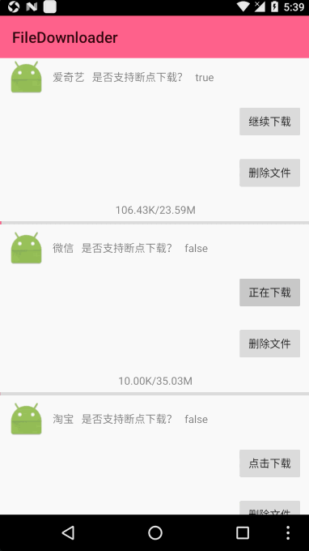

# FileDownloader
* 多任务下载
* 断点续传
* 支持线程数控制


### 效果图 


# Code


### DownloadManager.java

```java
/**
 * DownloadManager
 *
 * @author Edwin.Wu
 * @version 2017/1/16 15:27
 * @since JDK1.8
 */
public class DownloadManager {

    private static DownloadManager instance;
    private final Context context;

    private DownloadManager(Context context) {
        this.context = context;
        context.startService(new Intent(context, DownLoadService.class));
    }

    public static DownloadManager getInstance(Context context) {
        if (instance == null) {
            synchronized (DownloadManager.class) {
                if (instance == null) {
                    instance = new DownloadManager(context);
                }
            }
        }
        return instance;
    }

    public void down(DownLoadBean item) {
        Intent intent = new Intent(context, DownLoadService.class);
        intent.putExtra(Constants.KEY_DOWNLOAD_ENTRY, item);
        intent.putExtra(Constants.KEY_OPERATING_STATE, false);
        context.startService(intent);
    }

    public void delete(DownLoadBean item) {
        Intent intent = new Intent(context, DownLoadService.class);
        intent.putExtra(Constants.KEY_DOWNLOAD_ENTRY, item);
        intent.putExtra(Constants.KEY_OPERATING_STATE, true);
        context.startService(intent);
    }
}
```

### DownLoadService.java
```java
/**
 * 下载服务
 *
 * @author Edwin.Wu
 * @version 2017/1/12 10:43
 * @since JDK1.8
 */
public class DownLoadService extends Service {
    private String TAG = DownLoadService.this.getClass().getName();
    /**
     * 用于记录所有下载的任务，方便在取消下载时，通过id能找到该任务进行删除
     */
    private ConcurrentHashMap<String, DownLoadTask> mTaskMap = new ConcurrentHashMap<String, DownLoadTask>();

    private ThreadPoolExecutor downLoadExecutor = (ThreadPoolExecutor) Executors.newCachedThreadPool();

    private LinkedBlockingDeque<DownLoadBean> mWaitingQueue = new LinkedBlockingDeque<>();

    /**
     * 当下载状态发送改变的时候回调
     */
    private Handler handler = new Handler() {
        @Override
        public void handleMessage(Message msg) {
            super.handleMessage(msg);
            DownLoadBean bean = (DownLoadBean) msg.obj;
            int what = msg.what;
            switch (what) {
                case DownLoadState.STATE_ERROR:
                case STATE_DOWNLOADED:
                case STATE_DELETE:
                case DownLoadState.STATE_PAUSED:
                    Log.e("Message", "---> " + bean.toString());
                    mTaskMap.remove(bean.id);
                    DownLoadBean poll = mWaitingQueue.poll();
                    if (poll != null) {
                        downNone(poll);
                    }
                    break;
                default:
                    break;
            }

            DownLoadObservable.getInstance().setData(bean);
        }
    };

    /**
     * 当下载状态发送改变的时候调用
     */
    private void notifyDownloadStateChanged(DownLoadBean bean, int state) {
        Message message = handler.obtainMessage();
        message.obj = bean;
        message.what = state;
        handler.sendMessage(message);
    }


    /**
     * 下载
     *
     * @param loadBean object
     */
    public void download(DownLoadBean loadBean) {
        //TODO 先判断是否有这个app的下载信息,更新信息
        if (DataBaseUtil.getDownLoadById(getApplicationContext(), loadBean.id) != null) {
            DataBaseUtil.UpdateDownLoadById(getApplicationContext(), loadBean);
        } else {
            //TODO 插入数据库
            DataBaseUtil.insertDown(getApplicationContext(), loadBean);
        }

        int state = loadBean.downloadState;
        switch (state) {
            case DownLoadState.STATE_NONE://默认
                downNone(loadBean);
                break;
            case DownLoadState.STATE_WAITING://等待中
                downWaiting(loadBean);
                break;
            case DownLoadState.STATE_PAUSED://暂停
                downPaused(loadBean);
                break;
            case DownLoadState.STATE_DOWNLOADING://下载中
                downLoading(loadBean);
                break;
            case DownLoadState.STATE_CONNECTION://连接中
                break;
            case DownLoadState.STATE_ERROR://下载失败
                downError(loadBean);
                break;
            case STATE_DOWNLOADED://下载完毕
                Toast.makeText(BaseApplication.mContext, loadBean.appName + "->下载完毕", Toast.LENGTH_SHORT).show();
                break;
            default:
                break;
        }
    }


    @Nullable
    @Override
    public IBinder onBind(Intent intent) {
        Log.e(TAG, "IBinder");
        return null;
    }

    @Override
    public int onStartCommand(Intent intent, int flags, int startId) {
        Log.e(TAG, "onStartCommand");
        //TODO 执行
        if (intent != null) {
            DownLoadBean bean = (DownLoadBean) intent.getSerializableExtra(Constants.KEY_DOWNLOAD_ENTRY);
            if (bean != null) {
                boolean booleanExtra = intent.getBooleanExtra(Constants.KEY_OPERATING_STATE, false);
                if (booleanExtra) {
                    //TODO 删除下载
                    deleteDownTask(bean);
                } else {
                    //TODO 开始下载
                    download(bean);
                }
            }
        }
        return super.onStartCommand(intent, flags, startId);
    }


    public void deleteDownTask(DownLoadBean item) {
        //TODO 删除文件，删除数据库
        try {
            DownLoadTask remove = mTaskMap.remove(item.id);
            if (remove != null) {
                remove.cancle();
            } else {
                mWaitingQueue.remove(item);
            }
            item.downloadState = STATE_DELETE;
            DataBaseUtil.DeleteDownLoadById(getApplicationContext(), item.id);
            notifyDownloadStateChanged(item, STATE_DELETE);
        } catch (Exception e) {
            e.printStackTrace();
        }
    }

    private void downNone(DownLoadBean loadBean) {
        //TODO 最最最--->先判断任务数是否
        if (mTaskMap.size() >= DownLoadConfig.getConfig().getMax_download_tasks()) {
            mWaitingQueue.offer(loadBean);
            loadBean.downloadState = DownLoadState.STATE_WAITING;
            //TODO 更新数据库
            DataBaseUtil.UpdateDownLoadById(getApplicationContext(), loadBean);
            //TODO 每次状态发生改变，都需要回调该方法通知所有观察者
            notifyDownloadStateChanged(loadBean, DownLoadState.STATE_WAITING);
        } else {
            if (loadBean.totalSize <= 0) {
                ConnectThread connectThread = new ConnectThread(getApplicationContext(),
                        handler, mTaskMap, downLoadExecutor, loadBean);
                downLoadExecutor.execute(connectThread);
            } else {
                DownLoadTask downLoadTask = new DownLoadTask(getApplicationContext(),
                        handler, mTaskMap, loadBean);
                mTaskMap.put(loadBean.id, downLoadTask);
                downLoadExecutor.execute(downLoadTask);
            }
        }
    }

    /**
     * 等待状态
     */
    private void downWaiting(DownLoadBean loadBean) {
        //TODO 1.移出去队列
        mWaitingQueue.remove(loadBean);
        Log.e("Edwin", "mWaitingQueue size = " + mWaitingQueue.size());

        //TODO 2.TaskMap获取线程对象，移除线程;
        DownLoadTask downLoadTask = mTaskMap.get(loadBean.id);
        if (downLoadTask != null)
            downLoadTask.cancle();
        mTaskMap.remove(loadBean.id);

        //TODO 3.状态修改成STATE_PAUSED;
        loadBean.downloadState = DownLoadState.STATE_PAUSED;

        //TODO 4.更新数据库
        DataBaseUtil.UpdateDownLoadById(getApplicationContext(), loadBean);

        //TODO 5.每次状态发生改变，都需要回调该方法通知所有观察者
        notifyDownloadStateChanged(loadBean, DownLoadState.STATE_PAUSED);
    }


    /**
     * 暂停状态
     */
    private void downPaused(DownLoadBean loadBean) {
        //TODO 1.状态修改成STATE_WAITING;
        loadBean.downloadState = DownLoadState.STATE_WAITING;
        downNone(loadBean);
    }


    /**
     * 下载状态
     */
    private void downLoading(DownLoadBean loadBean) {
        //TODO 1.TaskMap获取线程对象，移除线程;
        DownLoadTask downLoadTask = mTaskMap.get(loadBean.id);
        if (downLoadTask != null) {
            downLoadTask.cancle();
            mTaskMap.remove(loadBean.id);
        } else {
            mWaitingQueue.remove(loadBean);
        }
//        //TODO 2.状态修改成STATE_PAUSED;
//        loadBean.downloadState = DownLoadState.STATE_PAUSED;
//        notifyDownloadStateChanged(loadBean, DownLoadState.STATE_PAUSED);
    }

    /**
     * 下载失败
     */
    private void downError(DownLoadBean loadBean) {
        //TODO 1.删除本地文件文件
        Log.i("Edwin", "删除本地文件文件 Id = " + loadBean.id);
        //TODO 2.更新数据库数据库
        DataBaseUtil.UpdateDownLoadById(getApplicationContext(), loadBean);

        loadBean.downloadState = DownLoadState.STATE_NONE;

//        /*********以下操作与默认状态一样*********/
//        //TODO 4.状态修改成STATE_WAITING；
//        //TODO 5.创建一个线程;
//        //TODO 6.放入TaskMap集合;
//        //TODO 7.启动执行线程execute
        download(loadBean);
    }


    @Override
    public void onDestroy() {
        Log.e(TAG, "onDestroy");
        super.onDestroy();
    }
}
```

### DownLoadTask.java

```java
/**
 * @author Edwin.Wu
 * @version 2017/1/16 14:17
 * @since JDK1.8
 */
public class DownLoadTask implements Runnable {
    private final Context context;
    private final Handler handler;
    private final ConcurrentHashMap<String, DownLoadTask> mTaskMap;
    private DownLoadBean bean;
    private volatile boolean isPaused = false;

    public DownLoadTask(Context context, Handler handler, ConcurrentHashMap<String, DownLoadTask> mTaskMap, DownLoadBean loadBean) {
        this.context = context;
        this.handler = handler;
        this.mTaskMap = mTaskMap;
        this.bean = loadBean;
    }


    @Override
    public void run() {
        File destFile = FileUtilities.getDownloadFile(bean.url);
        bean.path = destFile.getPath();
        HttpURLConnection connection = null;
        bean.downloadState = DownLoadState.STATE_DOWNLOADING;
        try {
            connection = (HttpURLConnection) new URL(bean.url).openConnection();
            connection.setRequestMethod("GET");
            if (bean.isSupportRange) {
                connection.setRequestProperty("Range", "bytes=" + bean.currentSize + "-" + bean.totalSize);
            }
            connection.setConnectTimeout(Constants.CONNECT_TIME);
            connection.setReadTimeout(Constants.READ_TIME);
            int responseCode = connection.getResponseCode();
            int contentLength = connection.getContentLength();


            RandomAccessFile raf = null;
            FileOutputStream fos = null;
            InputStream is = null;
            if (responseCode == HttpURLConnection.HTTP_PARTIAL) {
                Log.e("Edwin", bean.appName + " code = " + HttpURLConnection.HTTP_PARTIAL);
                raf = new RandomAccessFile(destFile, "rw");
                raf.seek(bean.currentSize);
                is = connection.getInputStream();
                byte[] buffer = new byte[2048];
                int len = -1;
                while ((len = is.read(buffer)) != -1) {
                    if (isPaused) {
                        break;
                    }
                    raf.write(buffer, 0, len);
                    bean.currentSize += len;
                    DataBaseUtil.UpdateDownLoadById(context, bean);
                    notifyDownloadStateChanged(bean, DownLoadState.STATE_DOWNLOADING);
                }
                raf.close();
                is.close();
            } else if (responseCode == HttpURLConnection.HTTP_OK) {
                Log.e("Edwin", bean.appName + " code = " + HttpURLConnection.HTTP_OK);
                bean.currentSize = 0;
                fos = new FileOutputStream(destFile);
                is = connection.getInputStream();
                byte[] buffer = new byte[2048];
                int len = -1;
                while ((len = is.read(buffer)) != -1) {
                    if (isPaused) {
                        break;
                    }
                    fos.write(buffer, 0, len);
                    bean.currentSize += len;
                    DataBaseUtil.UpdateDownLoadById(context, bean);
                    notifyDownloadStateChanged(bean, DownLoadState.STATE_DOWNLOADING);
                }
                fos.close();
                is.close();
            } else {
                bean.downloadState = DownLoadState.STATE_ERROR;
                DataBaseUtil.UpdateDownLoadById(context, bean);
                notifyDownloadStateChanged(bean, DownLoadState.STATE_ERROR);
            }


            if (isPaused) {
                bean.downloadState = DownLoadState.STATE_PAUSED;
                DataBaseUtil.UpdateDownLoadById(context, bean);
                notifyDownloadStateChanged(bean, DownLoadState.STATE_PAUSED);
            }
        } catch (Exception e) {
            e.printStackTrace();
            bean.downloadState = DownLoadState.STATE_ERROR;
            DataBaseUtil.UpdateDownLoadById(context, bean);
            notifyDownloadStateChanged(bean, DownLoadState.STATE_ERROR);
        }

        //TODO 判断是否下载完成
        if (bean.currentSize == bean.totalSize) {
            bean.downloadState = STATE_DOWNLOADED;
            DataBaseUtil.UpdateDownLoadById(context, bean);
            notifyDownloadStateChanged(bean, STATE_DOWNLOADED);
        }
    }


    public boolean isPaused() {
        return isPaused;
    }

    public void cancle() {
        isPaused = true;
    }
    
    /**
     * 当下载状态发送改变的时候调用
     */
    private void notifyDownloadStateChanged(DownLoadBean bean, int state) {
        Message message = handler.obtainMessage();
        message.obj = bean;
        message.what = state;
        handler.sendMessage(message);
    }

}
```

<br>
<br>
<br>
<br>
<br>

## MIT License

```
MIT License

Copyright (c) 2017 Edwin

Permission is hereby granted, free of charge, to any person obtaining a copy
of this software and associated documentation files (the "Software"), to deal
in the Software without restriction, including without limitation the rights
to use, copy, modify, merge, publish, distribute, sublicense, and/or sell
copies of the Software, and to permit persons to whom the Software is
furnished to do so, subject to the following conditions:

The above copyright notice and this permission notice shall be included in all
copies or substantial portions of the Software.

THE SOFTWARE IS PROVIDED "AS IS", WITHOUT WARRANTY OF ANY KIND, EXPRESS OR
IMPLIED, INCLUDING BUT NOT LIMITED TO THE WARRANTIES OF MERCHANTABILITY,
FITNESS FOR A PARTICULAR PURPOSE AND NONINFRINGEMENT. IN NO EVENT SHALL THE
AUTHORS OR COPYRIGHT HOLDERS BE LIABLE FOR ANY CLAIM, DAMAGES OR OTHER
LIABILITY, WHETHER IN AN ACTION OF CONTRACT, TORT OR OTHERWISE, ARISING FROM,
OUT OF OR IN CONNECTION WITH THE SOFTWARE OR THE USE OR OTHER DEALINGS IN THE
SOFTWARE.
```
